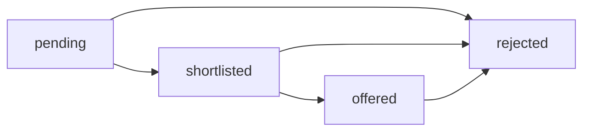

# Architecture

JobBoard Pro is split into a FastAPI backend, a SQLite database, a Next.js frontend, and pytest coverage for backend business rules.

## Backend Structure

- `backend/app/main.py` configures FastAPI, CORS, table initialization, routers, and structured error handlers.
- `backend/app/models.py` defines SQLAlchemy tables and enums.
- `backend/app/schemas.py` defines Pydantic request and response contracts.
- `backend/app/services.py` owns business rules so routers stay thin.
- `backend/app/routers/` exposes job, application, status, and stats endpoints.

## Data Model

### Job

Stores listing details: title, department, description, location, salary range, required skills, optional applicant cap, deadline, closed flag, and timestamps.

### Application

Stores applicant details linked to one job. `status` stores the current pipeline status for efficient filtering. A unique constraint on `(job_id, email)` enforces the duplicate-application decision.

### StatusHistory

Append-only event log linked to an application. Each row stores `from_status`, `to_status`, required manager note, and timestamp. The current status is updated on `Application`, but the review history is preserved in this table.

## API Design

| Method | Path | Purpose |
| --- | --- | --- |
| `POST` | `/api/jobs` | Create a listing |
| `GET` | `/api/jobs` | Browse jobs with filters and pagination |
| `GET` | `/api/jobs/{id}` | Read one listing |
| `POST` | `/api/jobs/{id}/applications` | Submit an application |
| `GET` | `/api/jobs/{id}/applications` | List applications, optionally filtered by status |
| `PATCH` | `/api/applications/{id}/status` | Move an application through the workflow |
| `PATCH` | `/api/jobs/{id}/close` | Manually close a job |
| `GET` | `/api/stats` | Return computed analytics |

Validation failures return a structured `422` body with `error`, `detail`, and field-level messages. Business-rule failures return `400`, `404`, or `409` with stable error codes.

## Status Workflow

Allowed moves are forward or to `rejected`. Backward moves, repeated statuses, and transitions out of `rejected` return `400 invalid_transition`. Every status update requires a manager note.

## Ambiguity Decisions

### Duplicate Applications

The same email cannot apply to the same job more than once. The block is permanent, even if the first application is rejected. This avoids duplicated candidate records and keeps the manager pipeline auditable.

### Pending Applications On Job Close

Existing `pending` applications remain pending when a job is manually closed. Closing a job means the company no longer accepts new applications; it does not silently reject candidates already in review.

### `max_applicants` Cap

When the cap is reached, the job remains open but stops accepting new applications. This keeps the listing state distinct from the intake cap and makes analytics easier to reason about.

## Analytics

`GET /api/stats` computes values live from SQLite:

- total jobs
- open jobs, defined as not manually closed and not expired
- closed jobs, including manually closed or expired jobs
- total applications
- average applications per job
- top department by application count
